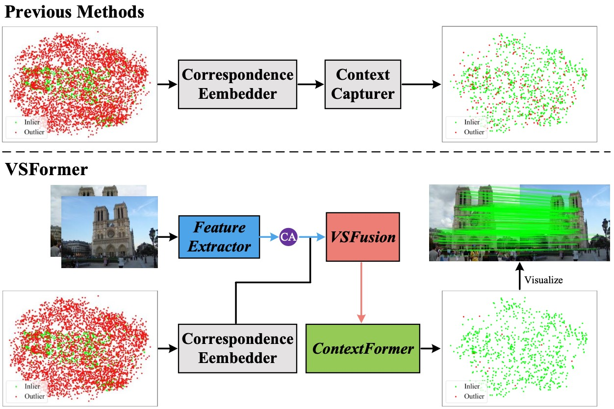

# VSFormer

Official implementation of [VSFormer: Visual-Spatial Fusion Transformer for Correspondence Pruning](https://arxiv.org/pdf/2312.08774.pdf). 

The paper has been accepted by AAAI 2024. 

## Introduction
VSFormer is able to identify inliers and recover camera poses accurately. 
Firstly, highly abstract visual cues of a scene are obtained with the cross attention between local features of two-view images. 
Then, these visual cues and correspondences are modeled by a joint visual-spatial fusion module, simultaneously embedding visual cues into correspondences for pruning. 
Additionally, to mine the consistency of correspondences, a novel module that combines the KNN-based graph and the transformer, effectively captures both local and global contexts.

<div align=center></div>

## Requirements

### Installation
We recommend using Anaconda or Miniconda. To setup the environment, follow the instructions below. 
```bash
conda create -n vsformer python=3.8 --yes
conda activate vsformer
conda install pytorch==1.7.1 torchvision==0.8.2 cudatoolkit=11.0 -c pytorch --yes
python -m pip install -r requirements.txt
```

### Dataset
Follow the instructions provided [here](https://github.com/zjhthu/OANet) for downloading and preprocessing datasets. 
The packaged dataset should be put in the `data_dump/` and directory structure should be: 
```
$VSFormer
    |----data_dump
      |----yfcc-sift-2000-train.hdf5
      |----yfcc-sift-2000-val.hdf5
      |----yfcc-sift-2000-test.hdf5
      ...
```

## Training & Evaluation
1. If you have multiple gpus, it is recommended to use `train_multi_gpu.py` for training. 
```
# train by multiple gpus
CUDA_VISIBLE_DEVICES=0,1 nohup python -u -m torch.distributed.launch --nproc_per_node=2 --use_env train_multi_gpu.py >./logs/vsformer_yfcc.txt 2>&1 &

# train by single gpu
nohup python -u train_single_gpu.py >./logs/vsformer_yfcc.txt 2>&1 &
```

2. Evaluation
```
python test.py
```

## Acknowlegment
This repo benefits from [OANet](https://github.com/zjhthu/OANet) and [CLNet](https://github.com/sailor-z/CLNet). Thanks for their wonderful works. 

## Citation
Thanks for citing our paper:

```
@article{liao2023vsformer,
  title={VSFormer: Visual-Spatial Fusion Transformer for Correspondence Pruning},
  author={Liao, Tangfei and Zhang, Xiaoqin and Zhao, Li and Wang, Tao and Xiao, Guobao},
  journal={arXiv preprint arXiv:2312.08774},
  year={2023}
}
```
